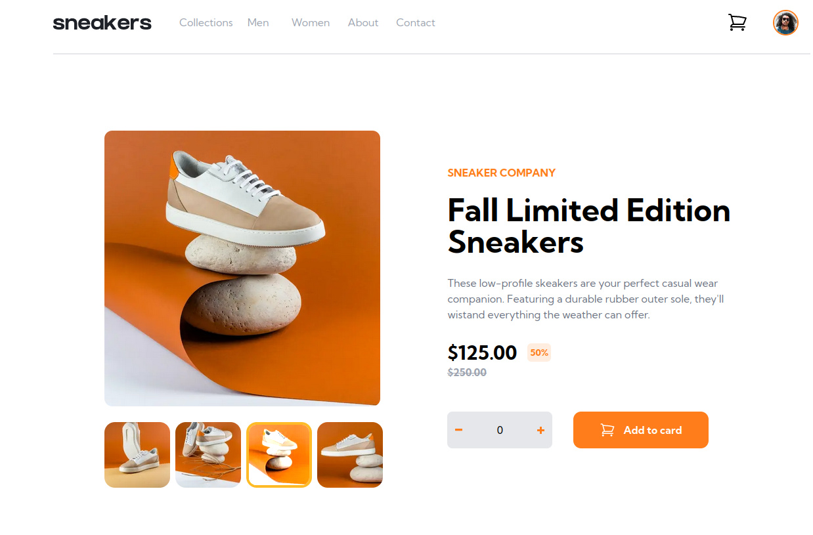

# Frontend Mentor - E-commerce product page solution

This is a solution to the [E-commerce product page challenge on Frontend Mentor](https://www.frontendmentor.io/challenges/ecommerce-product-page-UPsZ9MJp6). Frontend Mentor challenges help you improve your coding skills by building realistic projects.

## Table of contents

- [Overview](#overview)
  - [The challenge](#the-challenge)
  - [Screenshot](#screenshot)
  - [Links](#links)
- [My process](#my-process)
  - [Built with](#built-with)
  - [What I learned](#what-i-learned)
  - [Continued development](#continued-development)
  - [Useful resources](#useful-resources)
- [Author](#author)
- [Acknowledgments](#acknowledgments)

**Note: Delete this note and update the table of contents based on what sections you keep.**

## Overview

### The challenge

Users should be able to:

- View the optimal layout for the site depending on their device's screen size
- See hover states for all interactive elements on the page
- Open a lightbox gallery by clicking on the large product image
- Switch the large product image by clicking on the small thumbnail images
- Add items to the cart
- View the cart and remove items from it

### Screenshot



### Links

- Solution URL: [Add solution URL here](https://github.com/ttsoares/ecommerce-product-page)
- Live Site URL: [Add live site URL here](https://ecommerce-product-page-zeta-nine.vercel.app/)

## My process

### Built with

- Flexbox
- [React](https://reactjs.org/) - JS library
- [Next.js](https://nextjs.org/) - React framework
- [react-burger-menu](https://www.npmjs.com/package/react-burger-menu) - Library to facilitate burger menus

### What I learned

The use of the burger-menu library and the properties 'peer' of TailwindCSS

To see how you can add code snippets, see below:

```jsx
<nav className="hidden md:flex h-20 ">
  {MENU_LIST.map((item, index) => (
    <div key={index} className="flex flex-col justify-evenly">
      <div className="w-20 relative text-center">
        <div className="peer w-20 h-6 text-gray-400">
          <Link href={item.href}>{item.text}</Link>
        </div>
        <div className="absolute top-6 hidden peer-hover:block w-20 h-1 bg-orange mt-8"></div>
      </div>
    </div>
  ))}
</nav>
```

### Continued development

Keep unveiling the deeps of Tailwind...

### Useful resources

- [Jotai](https://www.npmjs.com/package/jotai) - Primitive and flexible state management for React

## Author

- Website - [Thomas Tschoepke Soares](https://www.linkedin.com/in/thomas-soares-6791781b/)
- Frontend Mentor - [@ttsoares](https://www.frontendmentor.io/profile/ttsoares)

## Acknowledgments

This was - by far - the hardest project of all I completed in frontendMentor !
It is surprising that was classified as `Intermediary`...
